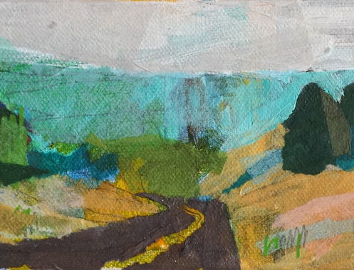

#  Welcome {-} 

This is either the  website or the text called __"A  Ride in Targeted Learning
Territory"__. In the former case, the text can be dowloaded by clicking on the
dedicated button  in the  top part  of the  webpage. In  the latter  case, the
website              can               be              browsed              at
[https://achambaz.github.io/tlride/](https://achambaz.github.io/tlride/
"TLRIDE"). 


```{r cover, fig.width = 7, echo = FALSE}

```

```{block, type = "center"}
Long Mendocino Drive (detail, [Liana Steinmetz](https://www.lianasteinmetz.com/))
```

__Organization__ 

The text  takes the  form of  a series  of brief  sections. The  main sections
combine theoretical and computational developments. The code is written in the
programming  language [`R`](https://www.r-project.org).   `R`  is widely  used
among statisticians  and data scientists  to develop statistical  software and
data analysis.

Regularly, a section  is inserted that proposes exercizes.   Each such section
is indicated by the  <span style="color:red">&#9881;</span> \gear symbol.  The
symbol  <span  style="color:red">&#9761;</span> \stixdanger{}  also  indicates
those sections whose content is more involved.

__Overview__

After a short introduction, we present the reproducible experiment that will
play a central role throughout the text. Then, we introduce the main parameter
of interest.  We  comment upon some of  its properties that are  useful from a
statistical perspective.  This paves  the way to  the presentation  of several
estimators that  are increasingly more powerful  statistically. The discussion
takes us into *targeted learning territory*.


__Audience__

The  text  might  be  of  interest  to  students  in  statistics  and  machine
learning. It might also serve as a gentle introduction to targeted learning in
both its theoretical and computational  aspects before delving deeper into the
literature [@TMLEbook11], [@TMLEbook18].

The   text   was  presented   at   the   [Journées  d'Étude   en   Statistique
2018](https://www.sfds.asso.fr/fr/group/activites_et_parrainages/608-journees_detude_en_statistique/)
held in  Fréjus (France) in  October 2018 and at  the [First Summer  School in
Statistics  and  Data  Science  for  Young  Researchers  from  French-speaking
Africa](https://ehermellin.github.io/conf_sfds/index.html)   held   at   [AIMS
Senegal](https://aims-senegal.org/) (M'bour, Senegal) in July 2019.

__Technical details__

The   text   is    written   in   [`RMarkdown`](https://rmarkdown.rstudio.com)
with         [`bookdown`](https://bookdown.org).         Assuming         that
the  [`knitr`](https://yihui.name/knitr/)   package  is  installed,   you  can
retrieve all the `R` code by running

```{r extract, eval = FALSE}
knitr::purl("abcd.Rmd")
```

<!--It is automatically rebuilt from
[source](https://github.com/achambaz/tlride)                                by
[travis](http://travis-ci.org/).-->

